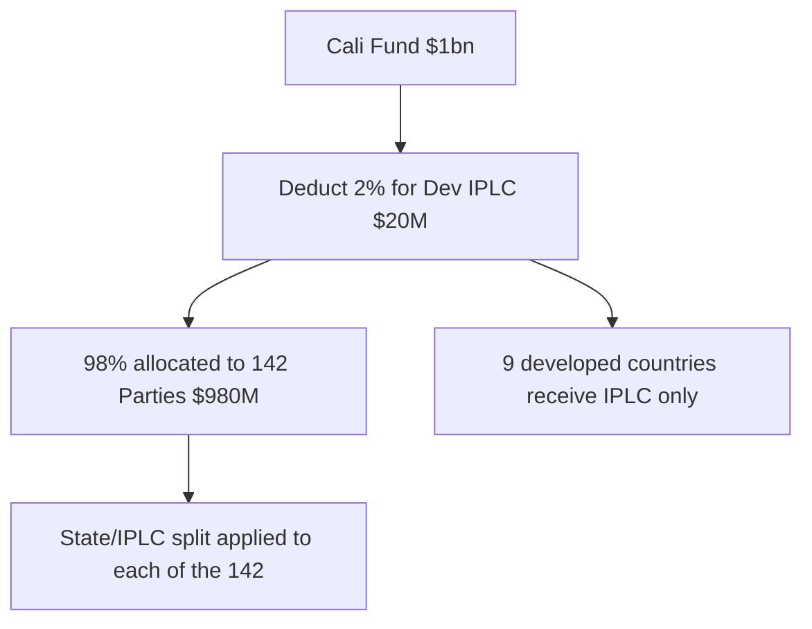
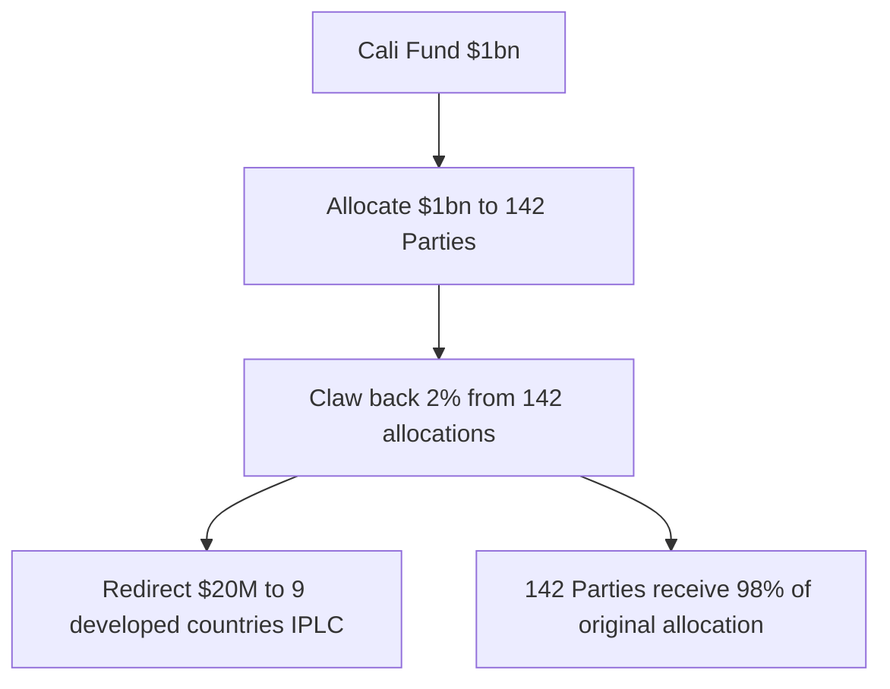
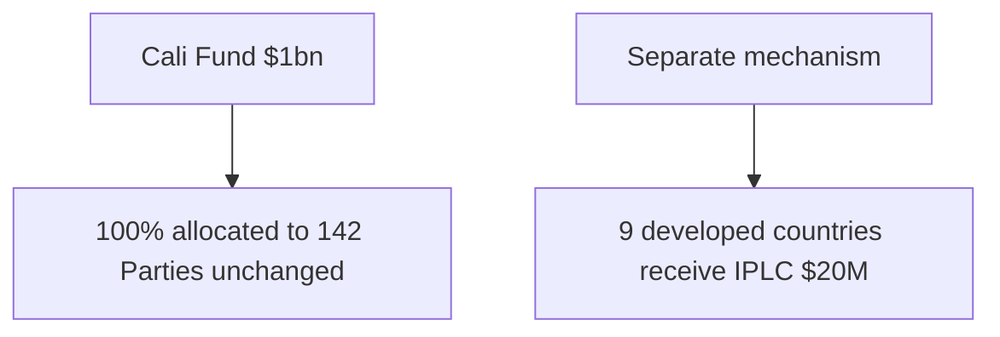
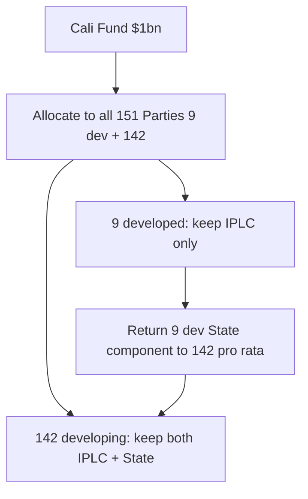

# IPLC Developed-Country Integration: Structural Options Analysis

**Date:** 2026-04-21  
**Branch:** iplc  
**Context:** The IPLC component for 9 developed countries (Australia, Canada, Denmark, Finland, Japan, New Zealand, Norway, Russian Federation, Sweden) represents 2.1–2.3% of the Cali Fund under two hypothetical scenarios.

## The Problem

The Cali Fund currently allocates to ~142 eligible Parties (developing countries, excluding high-income). The developed countries' IPLC shares represent a small but politically significant percentage of the fund. The question is: where does this 2% sit in the allocation pipeline for the existing 142?

### Reference Values

| Scenario | IPLC Total (USD M, $1bn fund) | Cali Fund (%) |
|----------|-------------------------------|---------------|
| Option 1: Raw Equality | 22.96 | 2.30% |
| Option 2: Banded IUSAF | 21.09 | 2.11% |

---

## Option A: Pre-deduction ("top-slice")

**Calculation:**
- Fund input changes: use `(Fund Size - Dev IPLC Total)` instead of `Fund Size`
- Existing formula runs unchanged — only the denominator changes
- The 142 Parties' allocations are proportionally reduced

**Example at $1bn (Option 2 banded):**
- Fund after deduction: $1,000M − $21.09M = $978.91M
- Each of the 142 Parties gets their share of $978.91M instead of $1,000M
- Real reduction: ~2.1% per Party

**Political framing:**  
*"Developed countries' IPLC is taken off the top before allocation to developing countries"*  
- Transparent and honest
- The 142 see 2% less in their envelope
- May feel like "our money is being redirected to rich countries"

---

## Option B: Post-deduction ("claw-back")

**Calculation:**
- First allocate the full fund to the 142 (existing formula)
- Then proportionally reduce each Party's allocation by 2%
- Redirect the clawed-back amount to developed-country IPLC

**Example at $1bn (Option 2 banded):**
- Each Party's allocation is reduced by ~2.1% pro rata
- Produces the same result as Option A but with an extra step

**Political framing:**  
*"2% is deducted from each developing country's allocation to fund developed-country IPLC"*  
- Same monetary outcome as Option A
- Worse politics — Parties see their full allocation then see it reduced
- Creates perception of loss rather than upfront transparency

---

## Option C: Separate Window / Supplementary Source

**Calculation:**
- Zero change to the existing model
- The 142 allocations are completely untouched
- Developed-country IPLC funding comes from a separate source

**Example at $1bn (Option 2 banded):**
- 142 Parties receive full allocations as currently modelled
- Additional $21.09M must be sourced from elsewhere (voluntary contributions, separate fund, etc.)

**Political framing:**  
*"Developed countries fund their own IPLC component through a separate mechanism"*  
- Best for the 142 — no impact on their allocations
- Risk: the developed-country IPLC funding becomes an unfunded mandate
- Requires political commitment that the money actually materialises

---

## Option D: Unified Pool with State-Component Return

**Calculation:**
1. Include the 9 developed countries in the allocation formula (either equality or banded)
2. Run the formula on all 151 Parties
3. Developed countries receive their IPLC component only
4. Developed countries' State component (the other 50%) is redistributed pro rata to the 142

**Example at $1bn (Option 2 banded):**
- 9 developed countries' total allocation: ~$42.19M
- Their IPLC component (50%): ~$21.09M → kept
- Their State component (50%): ~$21.09M → returned to the 142
- 142 Parties receive: ~$978.91M (their original share) + ~$21.09M (redistributed) = ~$1,000M
- Net effect: 142 Parties receive slightly more than 98% because they get the developed countries' State component back

**Political framing:**  
*"IPLC is for all Parties. The State component is for developing countries only. Developed countries receive only the IPLC share, and their State allocation returns to the developing-country pool."*  
- Clearest principled distinction: IPLC is universal, State allocation is for developing countries
- The 142 get a small uplift — a tangible benefit
- Avoids "our money going to rich countries" framing
- Transparent and principled

---

## Comparison Summary

| | Calculation clarity | 142 impact | Political framing for 142 | Risk |
|---|---|---|---|---|
| **A: Top-slice** | Very clean | −2% | "Dev countries take 2% off the top" | Perceived loss |
| **B: Claw-back** | Messy (same result as A) | −2% | "Our allocation is being reduced" | Perception of loss |
| **C: Separate window** | Very clean | 0% | "No impact on us" | Unfunded mandate risk |
| **D: Unified + return State** | Moderate | +small uplift | "Only IPLC for them, State share returns to us" | Slightly more complex |

---

## Recommendation

**Option D is the strongest overall approach** because:

1. **Principled**: Makes a clear distinction between IPLC (universal) and State allocation (developing countries only)
2. **Beneficial to 142**: The 142 get a small uplift from the returned State component — a tangible political benefit
3. **Transparent**: The calculation is visible and auditable
4. **Negotiation-ready**: The framing — "IPLC for all, State allocation for developing countries" — is easy to communicate and defend

**Option A is the pragmatic fallback** if Option D proves too complex to implement or negotiate. It is calculation-clean and transparent, though the political framing is weaker.

**Option C should be considered if there is genuine political will to fund developed-country IPLC from a separate source** — it is the cleanest for the 142 but depends on funding materialising.

---

## Implementation Notes (for future work)

- Option A requires only a one-line change to the fund-size input
- Option B is not recommended (same result as A, worse framing)
- Option C requires no model changes but needs political commitment
- Option D requires:
  1. Include 9 developed countries in the allocation formula
  2. Extract IPLC component for developed countries
  3. Calculate developed countries' State component
  4. Redistribute State component pro rata to the 142
  5. Display both the original and redistributed amounts

## Output File References

| File | Content |
|------|---------|
| `model-tables/iplc-option1-equality-*.csv/.docx/.md` | Scenario 1 outputs (raw equality) |
| `model-tables/iplc-option2-banded-*.csv/.docx/.md` | Scenario 2 outputs (banded IUSAF) |
| `model-tables/iplc-option1-equality-iplc-summary.csv/.docx` | IPLC-only summary, Option 1 |
| `model-tables/iplc-option2-banded-iplc-summary.csv/.docx` | IPLC-only summary, Option 2 |
| `iplc-developed/specification.md` | Original spec and instructions |
| `iplc-developed/test_validation.py` | Validation tests |
| `scripts/generate_iplc_developed_tables.py` | Main generation script |
| `scripts/generate_iplc_md.py` | Markdown generation script |
| `tests/test_iplc_developed.py` | Unit tests |
